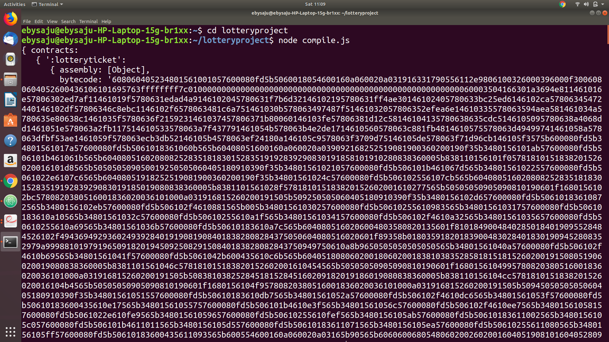
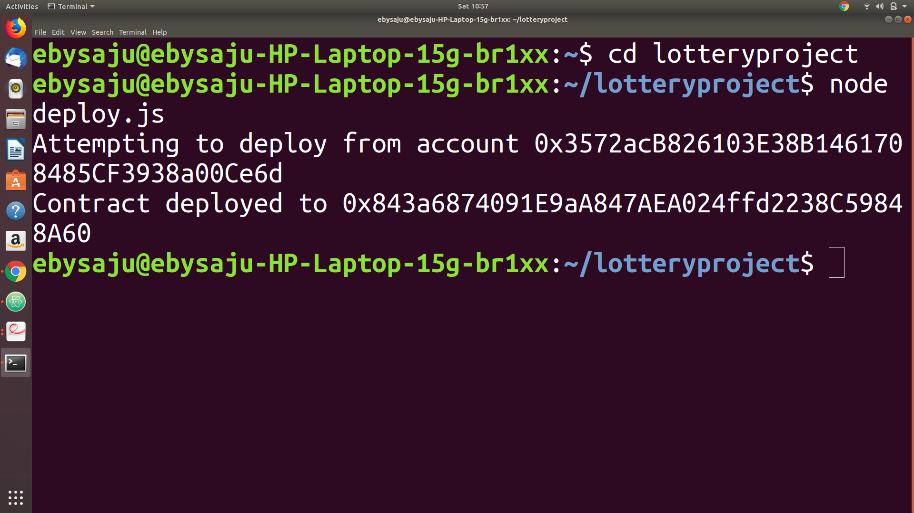
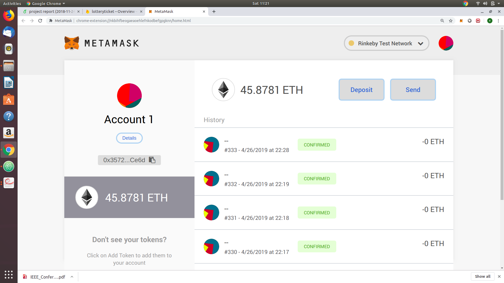

## E-Lottery system with ethereum block chain and React JS tested using MetaMask

# UI
  React JS
# Technologies Used
  Ethereum Blockchain,Node JS,Web3 Js
# Blockchain Contract Language
  Solidity
# Cryptographic Hash Function
  Keccak 256
# Ethereum Test Network
  RinkebyTestNetwork using MetaMask
